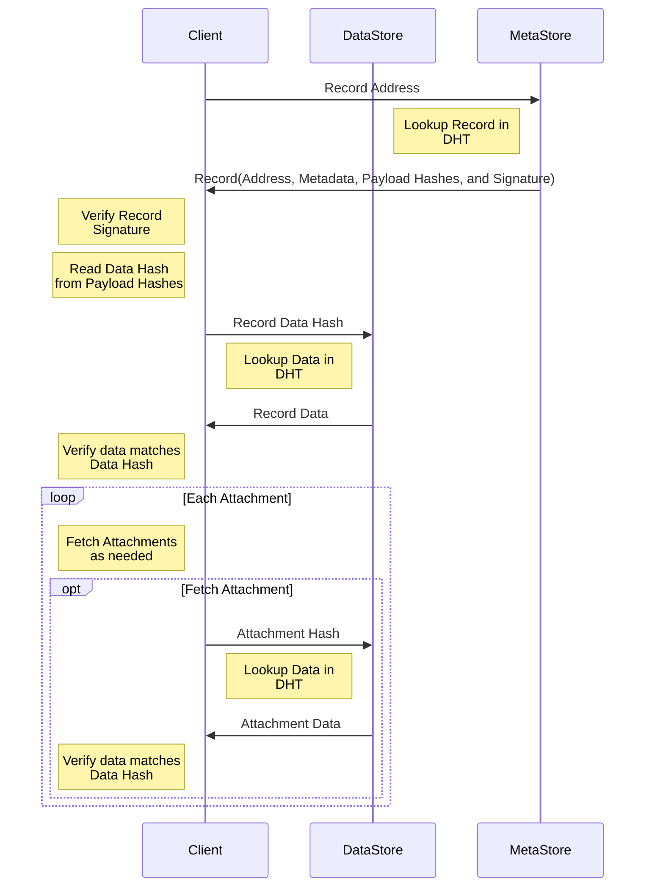

```mermaid
sequenceDiagram
  participant Client
  participant DataStore
  participant MetaStore

  Client->>MetaStore: Record Address
  Note left of MetaStore: Lookup Record in<br>DHT 
  MetaStore->>Client: Record(Address, Metadata, Payload Hashes, and Signature)
  Note left of Client: Verify Record<br>Signature

  Note left of Client: Read Data Hash<br>from Payload Hashes
  Client->>DataStore: Record Data Hash

  Note left of DataStore: Lookup Data in<br>DHT 

  DataStore->>Client: Record Data
  Note left of Client: Verify data matches<br>Data Hash

  loop Each Attachment
    Note left of Client: Fetch Attachments<br>as needed
    opt Fetch Attachment
      Client->>DataStore: Attachment Hash

      Note left of DataStore: Lookup Data in<br>DHT 

      DataStore->>Client: Attachment Data
      Note left of Client: Verify data matches<br>Data Hash
    end
  end
```
