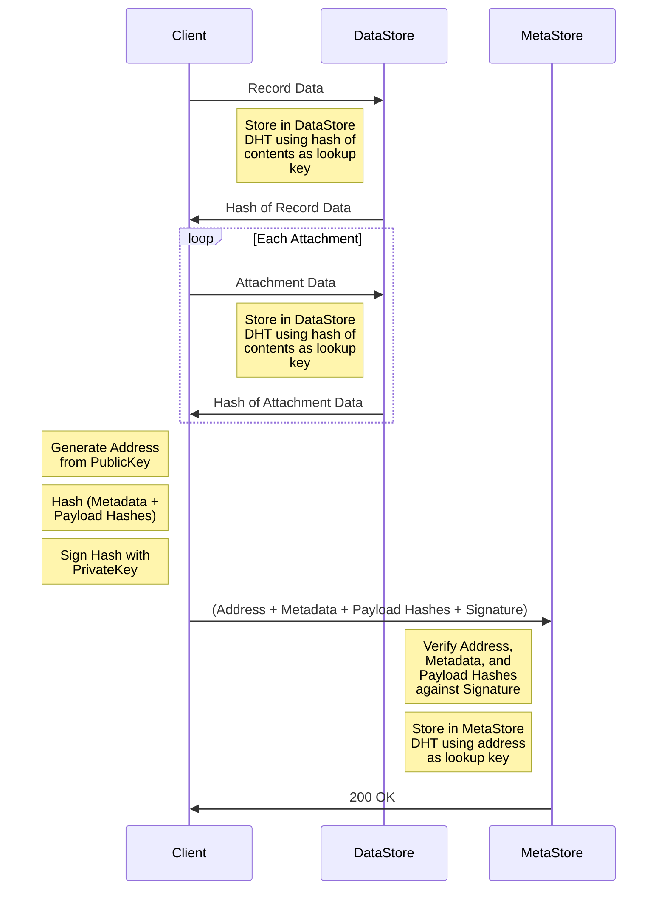

```mermaid
sequenceDiagram
  participant Client
  participant DataStore
  participant MetaStore

  Client->>DataStore: Record Data
  Note left of DataStore: Store in DataStore<br>DHT using hash of<br>contents as lookup<br>key
  DataStore->>Client: Hash of Record Data

  loop Each Attachment
    Client->>DataStore: Attachment Data
    Note left of DataStore: Store in DataStore<br>DHT using hash of<br>contents as lookup<br>key
    DataStore->>Client: Hash of Attachment Data
  end

  Note left of Client: Generate Address<br>from PublicKey
  Note left of Client: Hash (Metadata + <br>Payload Hashes)
  Note left of Client: Sign Hash with <br>PrivateKey

  Client->>MetaStore: (Address + Metadata + Payload Hashes + Signature)
  Note left of MetaStore: Verify Address,<br>Metadata, and<br>Payload Hashes<br>against Signature
  Note left of MetaStore: Store in MetaStore<br>DHT using address<br>as lookup key
  MetaStore->>Client: 200 OK
```
